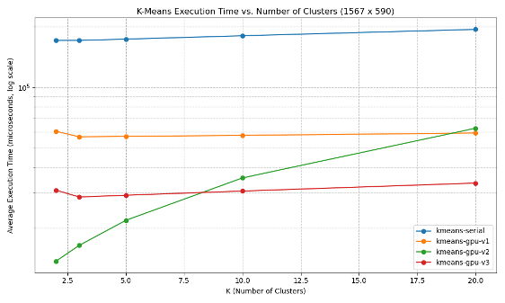
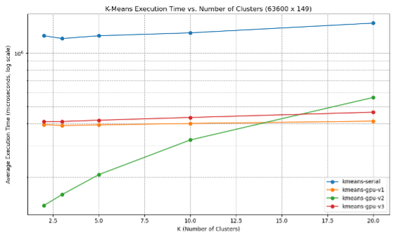

# GPU-Accelerated K-Means Clustering

This project explores multiple implementations of the K-Means clustering algorithm, with a focus on GPU acceleration. It benchmarks performance across datasets of varying size and dimensionality, highlighting the trade-offs between convenience, flexibility, and raw performance.

## Results at a glance

<p align="center">
  
</p>
<p align="center">
  
</p>

*Reproduce:* see **Reproduce in 60s** below.

---

## Overview

K-Means clustering partitions data into *K* clusters by minimizing intra-cluster variance. This repo implements and compares:

- A **sequential (CPU)** baseline  
- A parallel version using **OpenACC**  
- A highly tuned **KM-CUDA** GPU library  
- A custom **CUDA kernel** implementation

We evaluate scaling with dataset size and cluster count (*K*), with attention to memory access patterns, occupancy, and synchronization costs.

## Implementations

- `kmeans-serial.cpp` — Sequential CPU baseline.  
- `kmeans-gpu-v1.cpp` — Wrapper for the KM-CUDA library.  
- `kmeans-gpu-v2.cpp` — OpenACC implementation with automatic parallelization.  
- `kmeans-gpu-v3.cu` — Handwritten CUDA kernels for explicit control over layout and execution.

Each version is built with `make`, with preprocessor flags to toggle implementations.

## Reproduce in 60s

```bash
# 1) Build (adjust toolchain/paths as needed)
make

# 2) Run a small example (replace with your dataset path)
# Example CLI; adjust flags to your binary names/options
./bin/kmeans_cuda data/iris.csv --k 5 --iters 50 --seed 1

# 3) Benchmark all implementations (produces CSVs in ./results/)
python3 benchmark.py

# 4) Generate plots (writes/overwrites images used above)
python3 plot.py   --out-1 ./results_1567x590.png   --out-2 ./results_63600x149.png
```

> **Tip:** If your plotting scripts already emit these exact filenames, step 4 is optional.

## Benchmarking

```bash
python3 benchmark.py
```

The script runs all versions across a grid of configurations and records execution times. See `plot.py` for how the figures are derived (K sweep, dataset size, and dimensionality).

## Benchmark Highlights

- **KM-CUDA** is fastest on many large, medium-dimensional workloads due to production-grade kernels and memory handling.  
- **Handwritten CUDA** is competitive and can **beat KM-CUDA on high-dimensional datasets**, where careful shared memory use, coalescing, and loop unrolling pay off.  
- **OpenACC** shines on small inputs/low *K* with minimal code changes but scales less effectively due to limited control of memory/launch details.  
- **Serial CPU** provides a clear baseline for speedup comparisons.

## Usage

### Compilation
```bash
make
```

### Benchmarking
```bash
python3 benchmark.py
```

### Plotting Results
```bash
python3 plot.py
```

Generates performance graphs comparing implementations across:
- Varying **K** values
- Dataset size (rows × features)
- Dimensionality

## Notes

- The two result figures embedded above live at the repo root as:
  - `results_1567x590.png`
  - `results_63600x149.png`  
  If your files use a different extension, update the image paths accordingly.
- Profiling was conducted with **NVIDIA Nsight** to analyze occupancy, coalescing, divergence, and memory-bound behavior.
- For a clean reviewer experience, keep plots committed and include the exact command lines, GPU model, driver, and CUDA version you used.
